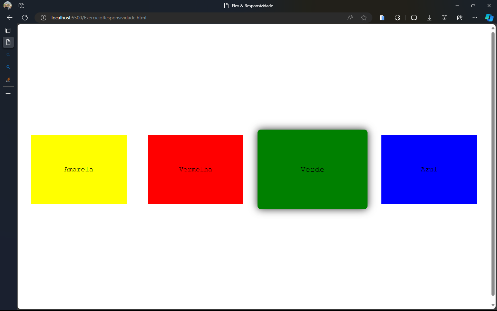
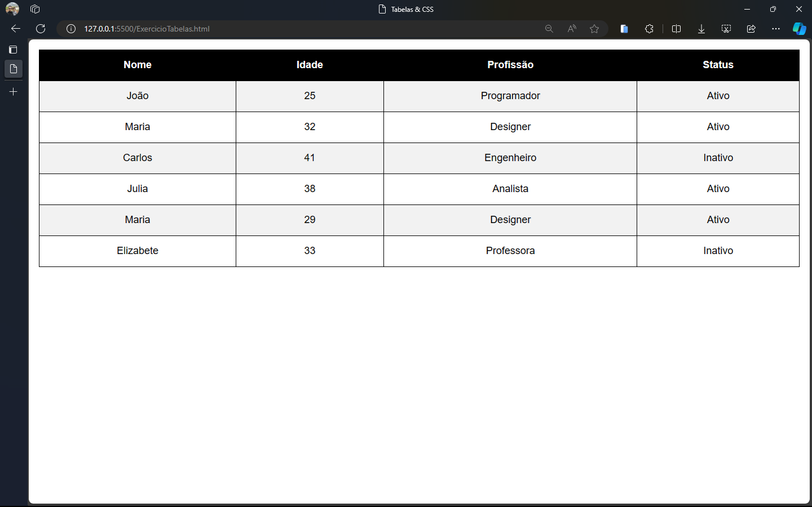

# four-is-the-number

📖 Sobre a atividade

1. Aplicar CSS no <a href="./ExercicioNoticias.html">Site de notícias</a>;

2. Utilizar as classes do bootstrap no <a href="./ExercicioNoticiasBootStrap.html">Site de notícias com bootstrap</a>;

3. Aplicar responsividade no <a href="./ExercicioResponsividade.html">Flex e Responsividade</a>;

4. Aplicar estilização no <a href="./ExercicioTabelas.html">Tabelas e CSS</a>

## Site de notícias

### Checklist de Instruções da tarefa

- (x) 1. Aplique a fonte Arial, sans-serif ao corpo da página e a todos os elementos;
- (x) 2. Aplique a cor de fundo #f3f3f3 ao corpo da página;
- (x) 3. Aplique a cor #333 ao título da notícia e o tamanho de 24px;
- (x) 4. Aplique a cor #666 ao autor da notícia e o tamanho de 14px;
- (x) 5. Aplique a cor #444 ao conteúdo da notícia e o tamanho de 16px;
- (x) 6. Aplique a largura de 100% à imagem da notícia;
- (x) 7. Aplique a margem de 20px à div container. Faça com que sua largura MÁXIMA seja de 800px e que fique centralizada na página; 
- (x) 8. Aplique a cor #fff ao fundo da div container;
- (x) 9. Aplique a sombra de 0 0 10px rgba(0, 0, 0, 0.1) à div container;
- (x) 10. Substitua a imagem de exemplo pela imagem dentro da pasta imagens;

### Print da tarefa concluida

## Site de notícias com Bootstrap

### Checklist de Instruções da tarefa
- (x) 1. Substitua a imagem de exemplo pela imagem dentro da pasta imagens.
- (x) 2. Utilizando somente classes do bootstrap, em especial a classe "card" e a classe "container", recrie o layout da notícia.
- (x) 3. Lembre-se que mais de uma classe pode ser aplicada a um elemento.

### Print da Tarefa concluida

## Exercício Responsividade
### Checklist de Instruções da tarefa

- (x) 1. Aplique display flex a tag <body> da página, e assim, faça com que as caixas sejam exibidas em linha e que o espaçamento entre elas seja distribuído de forma igual. 
- (x) 2. Utilizando agora, utilizando as propriedades display flex, flex-wrap e justify-content, faça com que as divs/caixas dentro da tag <body> sejam exibidas em linha e que o espaçamento entre elas seja distribuído de forma igual.
- (x) 3. Ao diminuir a largura da tela, as caixas se adaptem ao tamanho da tela e ainda mantenham a distância entre elas.
- (x) 4. Cada caixa deve possuir um tamanho mínimo de 20vw de largura e 20vh de altura.
- (x) 5. Aplique a transição de 0.5s em TODAS as caixas.
- (x) 6. As caixas devem ter as seguintes cores no background:
Amarela
Vermelha
Verde
Azul
- (x) 7. Ao reduzir o tamanho da tela para 768px, faça com que as caixas ocupem 100% da largura da tela.
- (x) 8. Utilize a propriedade cursor para que o cursor do mouse mude ao passar sobre as caixas.
- (x) 9. Utilize a propriedade font-family para que o texto das caixas seja exibido em uma fonte monoespaçada como a Courier.
- (x) **BONUS**: Ao passar o mouse sobre as caixas, elas devem aumentar de tamanho, criar uma sombra e arredondar as bordas. Utilize as propriedades de transformação (transform), box-shadow e border-radius para isso.  

### Print da tarefa concluida

## Tabelas e CSS

### Checklist de Instruções da tarefa

- (x) 1. Faça com que a tabela ocupe 100% da largura da tela;
- (x) 2. Aplique a propriedade border-collapse com o valor collapse para que as bordas das células da tabela sejam unidas;
- (x) 3. Aplique a propriedade border com o valor 1px solid #000 para que as bordas das células da tabela sejam exibidas;
- (x) 4. Aplique a propriedade padding com o valor 2vh para que haja um espaçamento interno entre o conteúdo das células e as bordas das células;
- (x) 5. Aplique a propriedade text-align para que o texto das células seja centralizado;
- (x) 6. Aplique a propriedade background-color e a propriedade color para que o cabeçalho da tabela tenha um fundo preto e o texto branco;
- (x) 7. Aplique a propriedade background-color com o valor #f2f2f2 para que as linhas PARES da tabela tenham um fundo cinza;
- (x) 8. Aplique a propriedade font-size com o valor 20px para que o texto das células tenha um tamanho de 20 pixels;
- (x) 9. Aplique a propriedade font-family com o valor 'Arial', sans-serif para que o texto das células seja exibido em uma fonte Arial;

### Print da tarefa concluida

